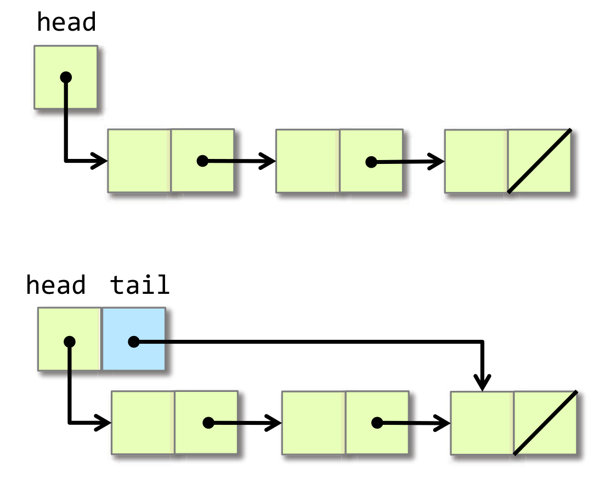
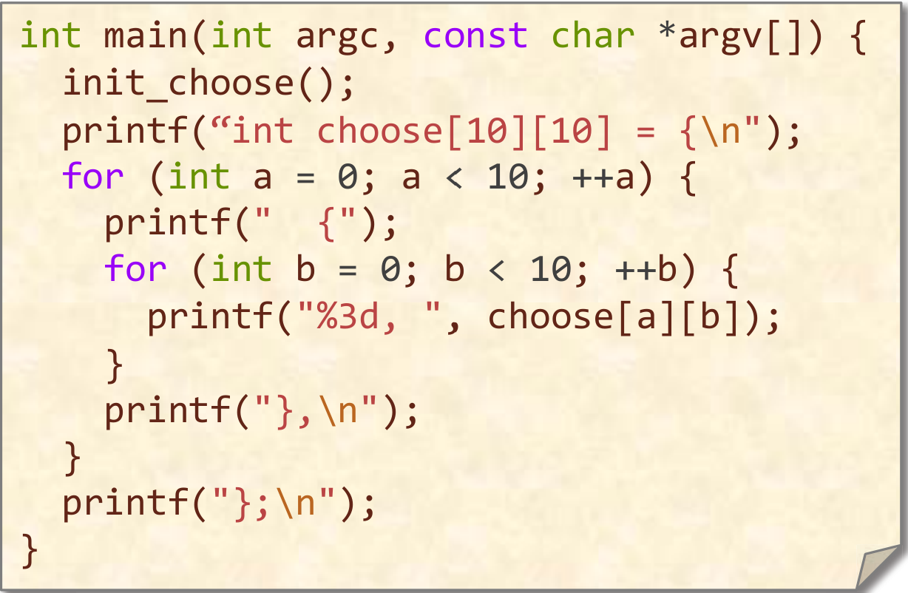
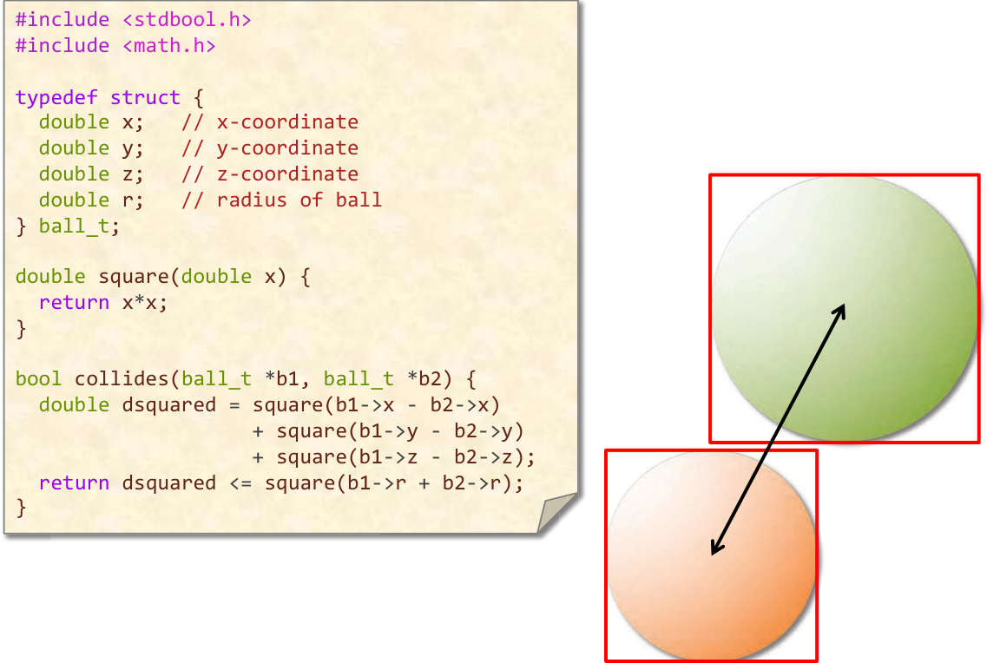

# 第二节 优化策略概览

**工作量(work)**：该程序执行的所有操作之总和。

在算法和数据结构中我们知道，一个算法的运行效率可以用**时间复杂度**进行刻画，如，$O(n^2)$的算法大体上运行的会比$O(nlogn)$的函数慢，当n变得更大时该差距更为明显，这是因为时间复杂度刻画了其增长快慢。而在此课程中，我们主要关注的是时间复杂度中被忽略了的常数，如在第一节矩阵乘法的示例中展现的一样，同样时间复杂度的算法可能会因为其前面常数的不同，而导致真实运行时间上相差数万倍。

因此，一个程序是否高效主要由以下两方面表现出来：
* 时间复杂度的量级（即，函数的增长快慢）
* 时间复杂度的常数（我将其称为*常数开销*）

由数学推导我们可以知道，前一种影响因素在两者中处于主导地位，因为对一个量级较大的算法，总能找到一个足够大的$n$，使得其真实的运行时间大于量级较小的算法。

但是由于某些因素的限制，导致我们无法使某一算法的时间复杂度进一步的下降（如，通用的排序算法的时间复杂度似乎只能降至$O(nlogn)$）。因此，降低常数开销的意义逐渐显现出来。同时，正如第一讲的示例中所展现出来的，通过利用现代处理器的特性（如，多核，多线程，超标量处理），我们可以极大地降低常数开销。

总体上，工作量较小的程序一般所需的运行时间较短，但是受到某些因素的影响可能会使情况恰好相反。典型的，指令并行化，可能会使工作量较小的程序反而运行更长的时间。

**Bentley's Rule**：一些优化的原则

* 编码和解码(Packing and Encoding)
比如，对于日期`September 11,2018`，我们可以使用一个字符串存储，这将需要18个字节，比两个`double`所需的大小还要多。而假设我们只考虑从公元前4096到4096年之间的时间，这之间大约有$365.25\times8192\approx3M$天，我们以公元前4096年的1月1日为0，每过一天将其加1，则大约只需22个bit（而`int`一般是32bit）就可以表示，这种方法广泛用于降低空间复杂度。同时，某些情况下，由于节约了数据传输的开销，该方法有时也可以降低时间复杂度，这取决于数据传输开销的降低是否可以抵消掉编解码开销的提升。Unix中的时间戳就是使用了这种方式。
或者我们也可以使用C中**位域**的特性，来记录这个时间
``` c
typedef struct{
    int year: 13;
    int month: 4;
    int day: 5;
}date_t;
```

* 增强(Augmentation)
我们可以在数据结构中添加一些额外的信息来让一些常见的工作效率更高。比如，在链表中引入尾指针来提高取出尾元素的速度。

这样的一个小小的改进可以将$O(n)$的访问操作降为$O(1)$的操作。

* 预计算(Precomputation)
比较经典的预计算方法有**记忆化搜索**，**动态规划**等方法，这是一种典型的“空间换时间”策略。

* 编译时初始化(Compile-Time Initialization)
~~OI中的打表也是这种方法的一种~~在编译时将所需的数据硬编码到程序中，这样我们所有的计算开销都是在编译过程中（生成代码的过程中），示例程序：


* 缓存(Caching)
使用一个或多个额外的变量来“模拟Cache”，这一种方法与前面的预计算有相似之处，该方法似乎只在某些特殊的情况下会有较好的效果。

* 稀疏化(Sparsity)
在某些数组中，可能存在很多值为0的情况，这样我们可以改变存储该数组的方式，来节省存储的空间同时减少所需的工作量。机器学习中常用的**稀疏矩阵**就是运用了这一种方法。

* 常量折叠和扩展(Constant Folding and Propogation)
编译器在编译时可以直接将常数计算出来，并写入可执行文件中，这样就不需要在执行时计算，由此提高程序的执行效率。

* 代数变形(Algebraic Identities)
利用代数性质进行变换，使结果的计算难度降低，如，假设我们需要计算$\sqrt{u} \le v$，则我们可以等价变形为$u\le v^2$，这样计算的代价便会大幅度降低。

* 短路性质(Short-Circuiting)
短路可以不局限于`&&`和`||`，比如在一个循环中，我们可以在满足某个条件时直接跳出循环，这也被称为短路。

* 顺序测试(Ordering Test)
类似上面的短路特性，当逻辑表达式特别长时，我们可以将较容易发生短路的表达式放在靠前的位置，这样更容易用更少的工作量得到表达式的值。

* 创建快速路径(Creating a Fast Path)
如果在后面需要计算较为复杂的表达式，我们可以首先验证一些较强的结论，如示例中所给的圆相交问题，我们可以首先在x轴方向上或是y轴方向上比较，这样就可能不需要计算根号或是平方。


* 合并测试(Combining Tests)
把多个测试合并为一个，这样可以减少分支预测，同时增加代码可读性（或许）。

* 常量移动(Hoisting)
如果在循环体的条件部分始终都要调用一个函数，而这个函数的值始终不变的话，我们可以将常量的计算移动到循环外，这样只需要调用一次这个函数就可以了，极大程度地减小了函数的开销。

* 添加哨兵值(Sentinels)
我们可以在数组的末尾添加哨兵值从而简化函数内部，避免分支预测产生的代价。

* 循环展开(Loop Unrolling)
分为完全循环展开(Full loop unrolling)和部分循环展开(Partial loop unrolling)，较常用（较实际）的方式为部分循环展开。
值得注意的是，循环展开过度可能导致iCache的命中率降低。

* 循环合并(Loop Fusion)
将多个起始和中止条件相似的循环合并成一个，减少循环控制产生的额外开销。

* 消除多余的迭代(Eliminating Wasted Iterations)
关注循环内容（尤其是包含控制流语句的代码块），看是否可以通过调整循环的起始和中止条件来优化循环，以消除多余的迭代。

* 函数的内联化(Inlining)
这个不用解释

* 消除尾递归(Tail-Recursion Elimination)
理论上，我们可以将尾递归的调用改写为循环形式，这样就能减少函数调用带来的额外开销。

* 粗粒度递归(Coarsening Recursion)
增大递归基础情况的规模，这样可以一定程度上减少递归导致的函数调用开销，如，快排当递归分治到一定程度时直接用插入排序来排序，这样避免了在小规模上递归调用函数产生的开销。

事实上，上述很多的优化手段都会被编译器自动使用来生成较为高效的代码。
