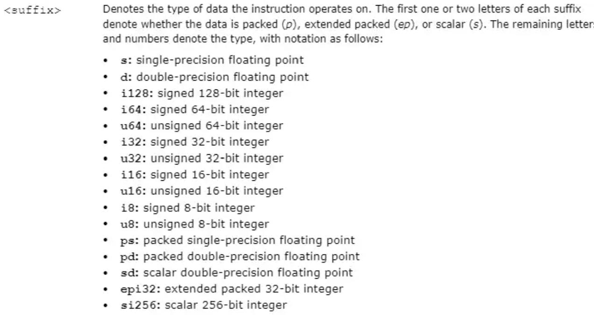
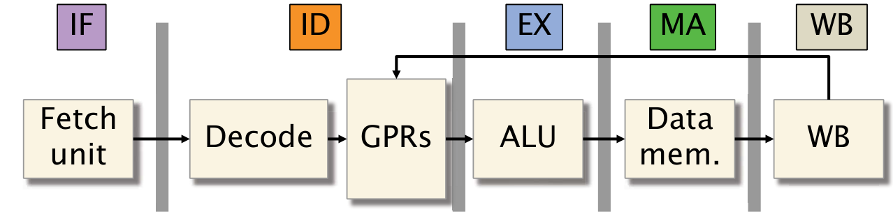

# 第四讲 汇编代码和CPU结构

### 浮点数运算
|指令前缀|操作数类型|
|:-------:|:----------:|
|ss|单精度浮点数(float)|
|sd|双精度浮点数(double)|
|ps|向量化单精度浮点数|
|pd|向量化双精度浮点数|

指令前缀标识了该指令所属的指令集，一般地，**AVX**指令集开头为`v`，**SSE**指令集开头为`p`，如`vmovsd`表示avx指令集中的双精度浮点数传输指令。

### 不同指令集的简介
* **SSE**: 提供了对整数，单精度浮点和双精度浮点的支持
* **AVX**: 提供了对单精度浮点和双精度浮点的支持
* **AVX2**: 在**AVX**的基础上，提供了对整数向量的支持。
* **AVX512(AVX3)**: 将并行化计算的宽度提高到了512位，同时提供了一些新的向量化操作，包括`popcount`等。

**SSE**指令集相对应的寄存器命名为`%xmm`，为128位，最多可同时处理两个操作数。
**AVX**指令集对应的寄存器命名为`%ymm`，为256位，最多可同时处理三个操作数。

[`vaddpd %ymm0,%ymm1,%ymm2`](https://www.intel.com/content/www/us/en/docs/intrinsics-guide/index.html#text=vaddpd&ig_expand=119)

### CPU结构概览

由图可知，当代CPU基本将执行指令分为五个环节：取址(Instruction Fetch)，解码(Instruction Decode)，执行(Execute)，内存操作(Memory)，写回(Write Back)。这样有利于CPU的流水线化，节省大量的执行时间。同时，当代处理器可能有不同的执行单元执行特定的操作，比如进行浮点运算和整数运算的ALU可能是不同的，这样便可以通过将一个指令拆分成多个微指令来提高运算的速度。

### 数据依赖的三种形式
* **写后读(Read after Write)**: 这是一种真实的数据依赖，因为读出的值依赖于前面写入的值
* **读后写(Write after Read)**: 这是一种可以被消除的依赖关系。顺序派遣，顺序写回的微架构，在指令派遣时候就已经从通用寄存器数组中读取了源操作数。后续执行的指令写回regfile的操作不可能影响到前面指令的读取，所以不可能发生WAR相关性造成的数据冲突。
* **写后写(Write after Write)**: 该依赖可以通过**寄存器重命名**技术来消除，然而由于真实的物理寄存器可能比所需的少，因此不一定可以完全消除。

