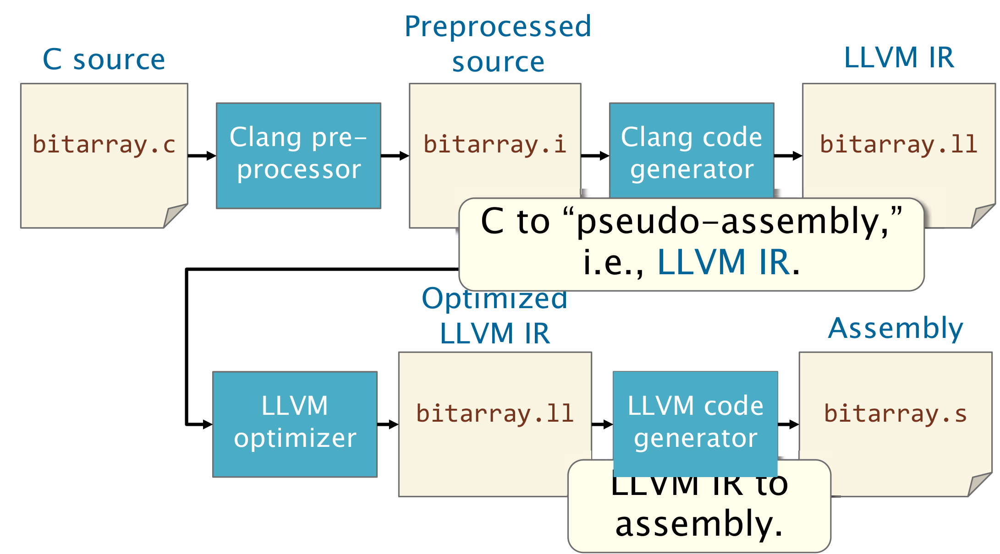
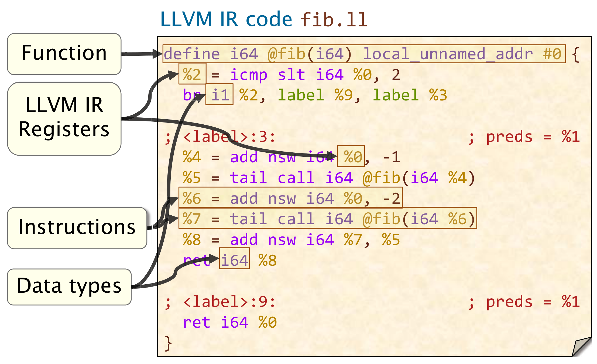
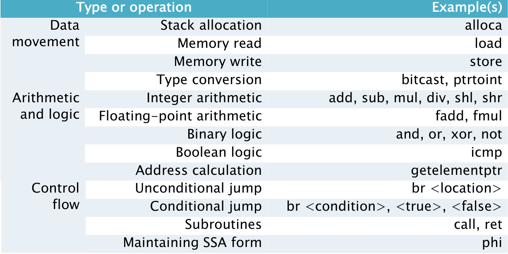
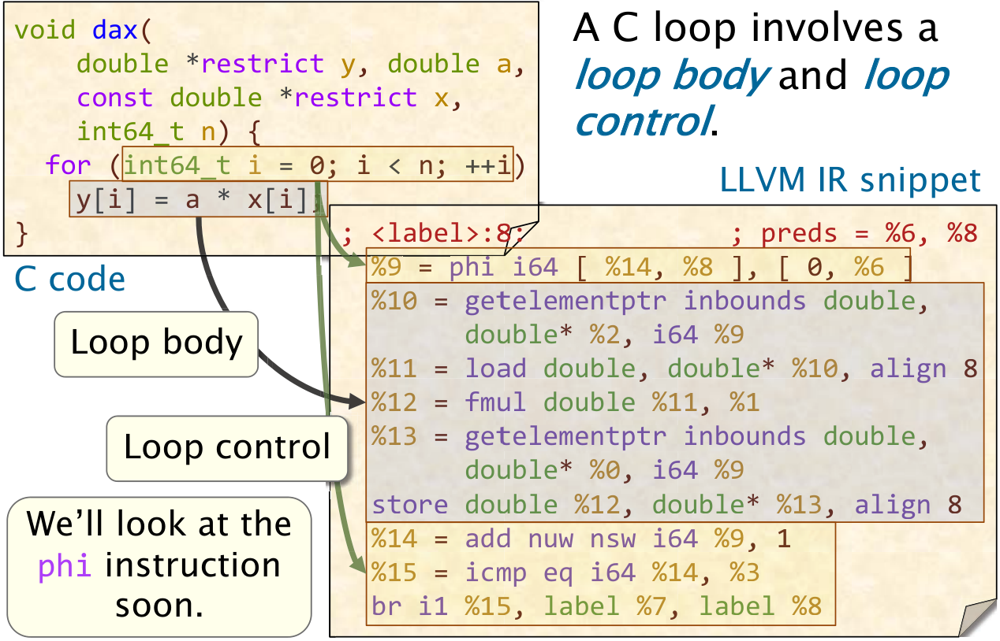

# 第五讲 C和汇编

将C源代码编译为可执行程序大致分为预处理->生成汇编->生成可重定向目标文件->链接生成可执行程序这四步，而对于clang/llvm编译器来说，在预处理和生成汇编之间插入了一个生成中间代码(IR)的过程，同时，llvm很多的优化也是在IR上进行的，我们以clang/llvm作为我们的研究对象。


为了生成clang IR文件，我们可以使用`-S -emit-llvm`选项。下面是一个IR代码的示例：


一条IR指令通常有如下结构：
$$
<destination\space oprand>=<opcode><source\space oprands>
$$
注意到源操作数可能有多个（source oprand***s***）

### llvm IR 和汇编之间的异同点比较
* IR有着更小的指令集，例如，我们在IR中不需要关注硬件的具体实现，这样可以避免产生一些由硬件相关特性而产生的特殊指令。
* IR中的寄存器类似于C中的变量（或者我们可以称其为*逻辑寄存器*），这样便于进行寄存器重命名等操作，优化程序性能。
* IR中没有FLAGS寄存器。
* IR中没有显式的栈指针，这点和上一点一样，让IR主要关注程序的逻辑而不是具体的指令的翻译，因而便于进行优化。
* IR有着类似于C的类型和函数系统

综上所述，我们可以看到IR是一种介乎于C和汇编之间的较高级抽象。
以下是一些常用的IR指令与操作之间的对应表格


### 从llvm IR构建程序的控制流图(Control Flow Graph)
**br**指令是通过llvm IR构建程序控制流图的关键指令，一般来说一条**br**指令可以标志着一个语句块的结束，一个无条件的**br**语句可以引出一个新的语句块，而一个有条件的**br**语句则可以引出两个新的语句块。这一点在刻画函数的**CFG**时十分有用。

### 关于*phi*指令
我们首先讨论**SSA(static single assignment)**概念，这个概念指的是一个寄存器最多可以在一个函数中被一条指令赋值，而LLVM要在整个IR代码中维持此原则，由此引发了一个问题：如果有多个语句块可以跳转到同一个语句块，比如
``` c
...
    for(int i=0;i<100;++i)
    {
        sum+=i;
    }
...
```
这段代码中，与`i`相关联的寄存器在循环体中会被多次赋值，而每一次循环我们不可能为`i`新开一个寄存器，于是我们便需要*phi*指令来实现多次的赋值。简单地说，这个指令会根据跳转前程序位于哪个语句块决定如何对`i`赋值，这样仍然可以维持LLVM IR的**SSA**原则。，比如下列程序：

那么，当程序顺序执行到*phi*指令时，`%9`的值为$0$（对应着`[0,%6]`），当程序从循环尾跳转到*phi*指令时，`%9`的值为`%14`（对应着`[%14,%8]`）

### IR中的属性
编译器生成的LLVM IR中，寄存器一般会被许多属性所修饰，比如上文中的`align 8`，这些属性一般有两个来源：*源码修饰*（如可能使用的`const`）和*编译器解析*（如上文中的对齐约定）。
